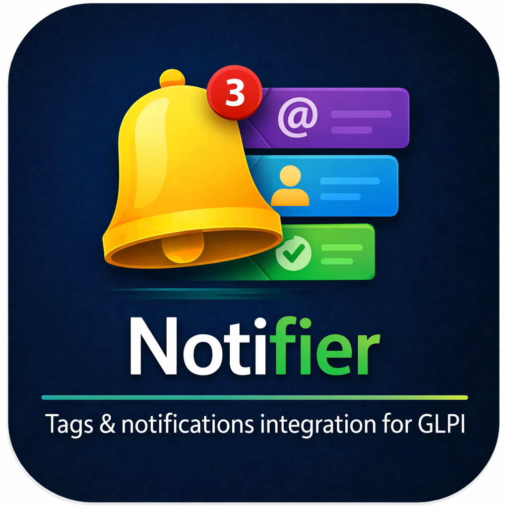

<p align="center">
  
</p>

<h1 align="center">Notifier</h1>

<p align="center">
  <strong>In-app notification bell, right inside GLPI.</strong><br>
  Every action that touches you as a technician lands in a floating dropdown.
</p>

<p align="center">
  
  
  
</p>

---

## What it does

Notifier adds a real-time notification bell to GLPI's central interface. The bell floats in the bottom-right of every page and can be minimized out of the way. Every event across the ITIL stack that affects you as a technician — new ticket, assignment, comment, status change, project task, solution — appears in a dropdown panel with a single click that takes you straight to the item. A preferences dialog lets each user opt out of specific update types.

### Features

- **Floating bell widget** - A bell button lives fixed in the bottom-right of the viewport, chat-widget style. An unread badge shows the number of pending items and the bell gently pulses when a new one arrives. Can be minimized to a slim edge tab and restored with one click; the state is remembered across page loads
- **Complete ITIL event coverage** - Notifier listens to every ITIL object in GLPI:
  - **Ticket / Change / Problem** - created concerning you, status changed, title/priority/content updated, new comment (ITILFollowup), new task, solution proposed
  - **Assignment** - fires the moment someone is added as assignee on any ITIL object, whether directly (Ticket_User / Change_User / Problem_User with type = ASSIGN) or via a group — group assignments automatically fan out to every member
  - **Project task** - created, updated, status / percent-done changed, added to the task team as user or group
- **Smart target resolution** - For each event, Notifier resolves every user that should hear about it: direct actors on the item (requester / observer / assign), every member of a group attached to the item, and the acting user is always filtered out so nobody gets a bell for their own action
- **All / Unread tabs** - A toggle at the top of the panel scopes the list; the choice sticks across page loads
- **Notification preferences** - A settings cog in the panel footer opens a per-type, per-channel dialog. Opt out of "direct" updates (items linked to you personally) and "group" updates (items assigned to a group you are in) independently, per ITIL type (Ticket / Change / Problem / Project task). Defaults to "all on" so no user is silenced out of the box
- **Per-row read/unread toggle** - A round button on each row flips its state without navigating; "Mark all as read" in the panel header zeroes the list at once
- **One-click redirect + auto read** - Clicking an item in the bell dropdown marks the row as read and jumps straight to the source item's form
- **Automatic cleanup** - When a ticket, change, problem or project task is purged, any notifications pointing at it are removed so the bell never dangles
- **Dedup window** - A 60-second window prevents the same event from generating multiple bell rows when a form saves several times in one request
- **Central interface only** - The bell is only loaded for the technician interface; self-service users are not touched
- **30 second polling** - The panel fetches fresh data on open; the badge refreshes in the background every 30 seconds
- **Multi-language** - English, Dutch, French, Spanish out of the box

### Supported languages

| Language | Code |
|----------|------|
| English | `en_GB` |
| Nederlands | `nl_NL` |
| Fran&ccedil;ais | `fr_FR` |
| Espa&ntilde;ol | `es_ES` |

---

## Requirements

| Requirement | Version |
|-------------|---------|
| GLPI | 10.0+ / 11.0+ |
| PHP | 8.1+ |

---

## Installation

1. Download the latest release
2. Extract and rename the folder to `notifier`
3. Place it in your GLPI `plugins/` directory
4. Go to **Setup > Plugins** and click **Install**, then **Enable**

Every logged-in technician will see their own bell as soon as they enter the central interface — there are no rights to configure.

### Upgrading

Place the new files over the existing plugin folder and go to **Setup > Plugins** to run any database migrations.

---

## Usage

Once installed and enabled there is nothing to configure — the bell appears in the bottom-right corner as soon as you log into the central interface. Actions anywhere in GLPI that touch you as a technician start landing in the dropdown in near real time (polled every 30 seconds).

### What triggers a notification

| Event | When |
|-------|------|
| **Assigned** | Someone adds you (or a group you are in) as an assignee on a Ticket, Change, Problem or Project task |
| **Created** | A Ticket / Change / Problem / Project task is created and you are one of its actors |
| **Commented** | A new ITIL followup is posted on an item where you are actor |
| **New task** | A new TicketTask / ChangeTask / ProblemTask is added to an item where you are actor, or you are the task's assigned technician |
| **Status changed** | The status of an ITIL item or project task you are linked to changes |
| **Updated** | The name, content, priority or urgency of an item you are linked to changes |
| **Solution** | An ITIL solution is proposed on your item |

The user that triggers an event is always filtered out — you never get a bell for your own actions.

### Interacting with the bell

- **Click the bell** to open the dropdown. Items are sorted unread-first, then by date.
- **Switch tabs** between All and Unread at the top of the panel; the choice is remembered.
- **Click an item** to jump straight to the source. The row is marked as read in the same request.
- **Click the toggle** on a row to flip its read/unread state without navigating.
- **Click "Mark all as read"** in the panel header to zero the entire list without navigating.
- **Click the Settings cog** in the panel footer to open the preferences dialog and opt out of specific update types.
- **Minimize** the bell via the chevron to slide it to the edge of the screen; click the restore tab to bring it back.
- The badge next to the bell shows the unread count (`99+` when over 99) and the bell animates once when a new notification arrives during the session.

### Preferences

The preferences modal lets each user choose, per ITIL type, whether they want:

- **Direct updates** — changes to items they are personally linked to (assignee, requester, observer, task tech)
- **Group updates** — changes to items assigned to a group they are a member of

All flags default to on, so a fresh install behaves like a plugin with no preferences at all. Changes take effect on the next event.

---

## Project structure

```
notifier/
├── setup.php                   # Plugin registration and event hooks
├── hook.php                    # Database install/uninstall
├── notifier.xml                # Plugin marketplace metadata
├── composer.json               # PSR-4 autoloading
├── src/
│   └── Notification.php        # Persistence + event dispatch + preferences
├── ajax/
│   ├── list.php                # Return unread count + items for session user
│   ├── markread.php            # Mark a single notification as read
│   ├── markunread.php          # Mark a single notification as unread
│   ├── markallread.php         # Mark every notification for the user as read
│   ├── preferences.php         # Get / save per-user notification preferences
│   ├── i18n.php                # Translation dictionary for the JS client
│   └── csrftoken.php           # Mint a fresh CSRF token for AJAX calls
├── css/notifier.css            # Bell widget styles
├── js/notifier.js              # Bell widget + polling client
├── public/                     # Mirror of css/ + js/ for GLPI 11 layout
├── locales/                    # Translation files (.po / .mo / .pot)
├── pics/                       # Plugin logo
├── CHANGELOG.md
├── LICENSE
└── README.md
```

---

## License

This project is licensed under the GNU General Public License v3.0 - see the [LICENSE](LICENSE) file for details.

Copyright &copy; 2026 DVBNL
